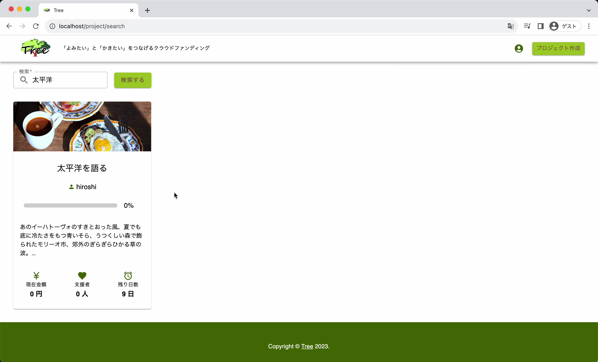

<h1>Tree </h1>

<h2>「よみたい」と「かきたい」をつなげるクラウドファンディング</h2>

コンテンツ大国ならではの日本だから抱える課題は例えば以下のようにある．

<ul>
<li>

1年以上連載を続けられる漫画は半分程度[1]

</li>
<li>

ライトノベル作家の3割が書籍化しても1冊止まり[2]

</li>
<li>

漫画『紫〇改343』がクラウドファンディングで2000万円以上を集金(達成率176%)[3]

</li>
</ul>

クリエーターの打ち切りの多さから来る需要も，読者サイドの需要も高いため，打ち切りになった作品をクラウドファンディングで復活させようと企画したのが本プロジェクトである．

本プロジェクトは創作物に特化したクラウドファンディングサービスであり，創作物に関心をもった人が集まるプラットフォームとして唯一のポジションを確立することが期待される．クリエーターまたは作品の評判だけでお金を集めることができるため，将来的には支援が集まれば出版までサービス内で連携が可能となることが想定される．

<h2>技術選定</h2>
<ul>
<li>React</li>
<li>MUI</li>
<li>Vite</li>
<li>Inertia</li>
<li>Laravel</li>
<li>MySQL</li>
<li>Docker</li>
</ul>

<h2>機能説明</h2>
<h3>URL</h3>
http://ec2-3-112-206-171.ap-northeast-1.compute.amazonaws.com:8085/
<h3>ホームページ</h3>

<h3>新規登録</h3>

<h3>プロジェクト詳細画面</h3>

<h3>プロジェクト作成画面</h3>

<h3>プロジェクト支援画面</h3>

<h3>プロジェクト検索画面</h3>

<h3>サイドバー</h3>

<h3>アカウント編集画面</h3>

<h3>プロジェクト編集画面</h3>

<h2>開発時期</h2>

2023年9月6日～2023年9月13日

<h2>参考資料</h2>
[1]<a href="https://soorce.hatenablog.com/entry/20190716/1563284789">半数以上は1年以下で打ち切り。週刊少年誌連載作品の「開始時期」と「連載期間」をデータ化・可視化してみてわかる、その厳しさ</a>
 
[2]<a href="https://note.com/you96/n/n0939fc02f696#c104c071-2b61-4b2a-931e-a3915bf8c276">2021年度版ライトノベル界隈状況調査</a>
 
[3]<a href="https://camp-fire.jp/projects/view/638852?list=project_instant_search_results">漫画『紫〇改343』若きパイロットたちの熱き闘いのエンディングを届けたい！！</a>

<h1><a href="#laravel-sail-を使ったチーム開発の始め方">Laravel Sail を使ったチーム開発の始め方</a></h1>

Laravel Sailを使用してチーム開発を行う場合，下記の手順となる．

<ul>
<li>

一人の開発者がプロジェクトを作成し，GitHub にソースコードを push する．

</li>
<li>

他の開発者は ↑ で作成された GitHub リポジトリをクローンし，手元で開発をすすめる．

</li>
</ul>

本資料は，既存のプロジェクトのリポジトリをクローンし，Docker 上で動作させるための手順を記載する．

<h2 id="事前準備"><a class="header" href="#事前準備">事前準備</a></h2>

docker が動く状態にしておく．

<pre>
<button class="fa fa-copy clip-button" title="Copy to clipboard" aria-label="Copy to clipboard"><i class="tooltiptext"></i></button>
<code class="language-bash hljs">docker -v

Docker version 20.10.12, build e91ed57

docker-compose -v

docker-compose version 1.26.2, build eefe0d31

</code></pre>

curl も必要．

<pre>
<button class="fa fa-copy clip-button" title="Copy to clipboard" aria-label="Copy to clipboard"><i class="tooltiptext"></i></button>
<code class="language-bash hljs">curl --version

curl 7.68.0 (x86_64-pc-linux-gnu) libcurl/7.68.0 OpenSSL/1.1.1f zlib/1.2.11 brotli/1.0.7 libidn2/2.2.0 libpsl/0.21.0 (+libidn2/2.2.0) libssh/0.9.3/openssl/zlib nghttp2/1.40.0 librtmp/2.3
Release-Date: 2020-01-08
Protocols: dict file ftp ftps gopher http https imap imaps ldap ldaps pop3 pop3s rtmp rtsp scp sftp smb smbs smtp smtps telnet tftp
Features: AsynchDNS brotli GSS-API HTTP2 HTTPS-proxy IDN IPv6 Kerberos Largefile libz NTLM NTLM_WB PSL SPNEGO SSL TLS-SRP UnixSockets
</code></pre>

<h2 id="プロジェクトのクローン"><a class="header" href="#プロジェクトのクローン">プロジェクトのクローン</a></h2>
<pre>
<button class="fa fa-copy clip-button" title="Copy to clipboard" aria-label="Copy to clipboard"><i class="tooltiptext"></i></button>
<code class="language-bash hljs">git clone REPOSITORY_URL
</code></pre>
<h2 id="必要なディレクトリの作成"><a class="header" href="#必要なディレクトリの作成">必要なディレクトリの作成</a></h2>

このまま起動すると必要なディレクト入りがなくてエラーになる．

そのため，下記コマンドを順に実行して必要なディレクトリを作成する．

<pre>
<button class="fa fa-copy clip-button" title="Copy to clipboard" aria-label="Copy to clipboard"><i class="tooltiptext"></i></button>
<code class="language-bash hljs">mkdir -p storage/framework/cache/data/
mkdir -p storage/framework/app/cache
mkdir -p storage/framework/sessions
mkdir -p storage/framework/views
</code></pre>
<h2 id="コンテナ動作に必要なファイルをダウンロード--インストール"><a class="header" href="#コンテナ動作に必要なファイルをダウンロード--インストール">コンテナ動作に必要なファイルをダウンロード &amp; インストール</a></h2>

Laravel Sail の実行に必要な vendor ディレクトリは Git では管理されていない．そのため，コマンドを実行して用意する必要がある．

下記コマンドを実行すると自動的に全部入る．6 行まとめて入力して実行すること．

<blockquote>

【参考】

<ul>
<li>

<a href="https://readouble.com/laravel/9.x/ja/sail.html">https://readouble.com/laravel/9.x/ja/sail.html</a>

</li>
<li>

上記 URL の「既存アプリケーションで Composer 依存関係のインストール」部分参照．

</li>
</ul>
</blockquote>
<pre>
<button class="fa fa-copy clip-button" title="Copy to clipboard" aria-label="Copy to clipboard"><i class="tooltiptext"></i></button>
<code class="language-bash hljs">docker run --rm \
    -u "$(id -u):$(id -g)" \
    -v $(pwd):/var/www/html \
    -w /var/www/html \
    laravelsail/php81-composer:latest \
    composer install --ignore-platform-reqs
</code></pre>
<h2 id="env-ファイルの準備"><a class="header" href="#env-ファイルの準備">env ファイルの準備</a></h2>

下記コマンドで準備する．

<pre>
<button class="fa fa-copy clip-button" title="Copy to clipboard" aria-label="Copy to clipboard"><i class="tooltiptext"></i></button>
<code class="language-bash hljs">cp .env.example .env
</code></pre>

ファイルができたら mysql 設定部分を以下のように編集する．

<strong><code class="hljs">DB_USERNAME</code> と <code class="hljs">DB_PASSWORD</code> が DB のアクセス情報となる．phpmyadmin もこの情報でログインすることとなる．</strong>

<pre>
<button class="fa fa-copy clip-button" title="Copy to clipboard" aria-label="Copy to clipboard"><i class="tooltiptext"></i></button>
<code class="language-txt hljs plaintext">DB_CONNECTION=mysql
DB_HOST=mysql
DB_PORT=3306
DB_DATABASE=プロジェクト作成者のDB名に合わせる
DB_USERNAME=プロジェクト作成者のユーザ名に合わせる
DB_PASSWORD=プロジェクト作成者のパスワードに合わせる

</code></pre>

<h2 id="動作確認"><a class="header" href="#動作確認">動作確認</a></h2>

下記コマンドでコンテナを立ち上げる

<pre>
<button class="fa fa-copy clip-button" title="Copy to clipboard" aria-label="Copy to clipboard"><i class="tooltiptext"></i></button>
<code class="language-bash hljs">./vendor/bin/sail up -d
</code></pre>

立ち上がったら下記コマンドを順に実行し，アプリケーションの準備を整える．

<pre>
<button class="fa fa-copy clip-button" title="Copy to clipboard" aria-label="Copy to clipboard"><i class="tooltiptext"></i></button>
<code class="language-bash hljs">./vendor/bin/sail php artisan key:generate
./vendor/bin/sail php artisan migrate
./vendor/bin/sail npm install
./vendor/bin/sail npm run dev
./vendor/bin/sail php artisan db:seed
</code></pre>

ブラウザから <code class="hljs">localhost</code> にアクセスするとアプリケーションの動作が確認できる．

また，<code class="hljs">localhost:8080</code> にアクセスすると phpmyadmin にアクセスできる．

コンテナ終了させるときは下記コマンドを実行する．

<pre>
<button class="fa fa-copy clip-button" title="Copy to clipboard" aria-label="Copy to clipboard"><i class="tooltiptext"></i></button>
<code class="language-bash hljs">./vendor/bin/sail down
</code></pre>
